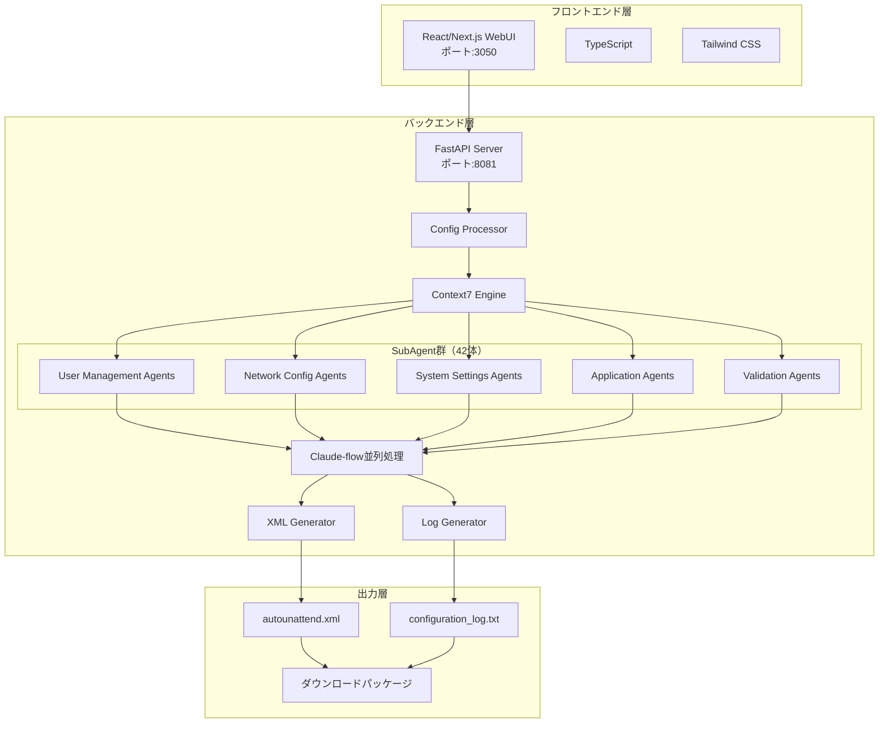

# システムアーキテクチャ

## 🏗️ システム全体構成



## 📦 モジュール構成

### フロントエンド構成
```
frontend/
├── src/
│   ├── pages/
│   │   ├── index.tsx           # メインページ（全23項目の設定UI）
│   │   └── _app.tsx            # Appコンポーネント
│   ├── components/
│   │   ├── DesktopConfigSection.tsx  # デスクトップ設定
│   │   ├── WiFiConfigSection.tsx     # Wi-Fi設定
│   │   ├── GenerationResult.tsx      # 生成結果表示
│   │   └── ErrorDisplay.tsx          # エラー表示
│   ├── services/
│   │   └── api.ts              # API通信サービス
│   ├── types/
│   │   └── comprehensive-config.ts   # 全23項目の型定義
│   └── styles/
│       ├── globals.css         # グローバルスタイル
│       └── Home.module.css     # ページ固有スタイル
```

### バックエンド構成
```
backend/
├── main.py                     # FastAPIメインアプリケーション
├── comprehensive_xml_generator.py    # XML生成エンジン（全23項目対応）
├── comprehensive_config_processor.py # 設定処理エンジン
├── comprehensive_log_generator.py    # 日本語ログ生成
├── config_transformer.py      # 設定変換ユーティリティ
└── app/
    ├── agents/                 # 42体のSubAgent実装
    │   ├── base_agent.py       # 基底クラス
    │   ├── user_agents.py      # ユーザー管理
    │   ├── network_agents.py   # ネットワーク設定
    │   ├── system_agents.py    # システム設定
    │   ├── application_agents.py # アプリケーション
    │   ├── feature_agents.py   # Windows機能
    │   ├── security_agents.py  # セキュリティ
    │   ├── optimization_agents.py # 最適化
    │   └── validation_agents.py   # 検証
    ├── claude_flow/
    │   └── parallel_processor.py  # 並列処理エンジン
    └── core/
        └── config.py           # Context7設定管理
```

## 🔄 データフロー

### 1. 設定入力フロー
```
ユーザー入力（WebUI）
    ↓
TypeScript型定義による検証
    ↓
JSON形式でAPIへ送信
    ↓
comprehensive_config_processor.pyで処理
    ↓
Context7エンジンで最適化
```

### 2. XML生成フロー
```
処理済み設定データ
    ↓
42体のSubAgentで並列処理
    ↓
comprehensive_xml_generator.pyで統合
    ↓
FirstLogonCommands生成（53個以上）
    ↓
XML名前空間の適用
    ↓
autounattend.xml出力
```

### 3. ログ生成フロー
```
設定データ
    ↓
comprehensive_log_generator.pyで処理
    ↓
日本語テキスト生成
    ↓
設定項目ごとにセクション分け
    ↓
configuration_log.txt出力
```

## 🚀 SubAgent群（42体）の詳細

### ユーザー管理エージェント群（8体）
1. **UserCreationAgent** - ユーザーアカウント作成
2. **UserPermissionAgent** - 権限設定
3. **UserGroupAgent** - グループ管理
4. **AutoLogonAgent** - 自動ログオン設定
5. **PasswordPolicyAgent** - パスワードポリシー
6. **AdminAccountAgent** - 管理者アカウント制御
7. **GuestAccountAgent** - ゲストアカウント制御
8. **DomainJoinAgent** - ドメイン参加処理

### ネットワーク設定エージェント群（6体）
9. **WiFiConfigAgent** - Wi-Fi設定
10. **EthernetConfigAgent** - 有線LAN設定
11. **FirewallAgent** - ファイアウォール設定
12. **IPv6Agent** - IPv6設定
13. **ProxyAgent** - プロキシ設定
14. **NetworkLocationAgent** - ネットワークの場所

### システム設定エージェント群（10体）
15. **RegistryAgent** - レジストリ設定
16. **ServiceAgent** - サービス管理
17. **ScheduledTaskAgent** - タスクスケジューラ
18. **PowerSettingsAgent** - 電源設定
19. **TimeZoneAgent** - タイムゾーン設定
20. **LocaleAgent** - ロケール設定
21. **UpdateAgent** - Windows Update設定
22. **TelemetryAgent** - テレメトリ制御
23. **PrivacyAgent** - プライバシー設定
24. **UAC_Agent** - UAC設定

### アプリケーション設定エージェント群（6体）
25. **AppRemovalAgent** - 不要アプリ削除
26. **DefaultAppAgent** - 既定のアプリ設定
27. **StoreAppAgent** - Microsoftストア設定
28. **OfficeAgent** - Office設定
29. **BrowserAgent** - ブラウザー設定
30. **MediaAgent** - メディア設定

### Windows機能エージェント群（8体）
31. **DotNetAgent** - .NET Framework設定
32. **HyperVAgent** - Hyper-V設定
33. **WSL_Agent** - WSL設定
34. **SandboxAgent** - Windows Sandbox
35. **IIS_Agent** - IIS設定
36. **SMB_Agent** - SMBプロトコル
37. **TelnetAgent** - Telnet/TFTP
38. **ContainerAgent** - コンテナー機能

### UI/UX設定エージェント群（4体）
39. **ExplorerAgent** - エクスプローラー設定
40. **TaskbarAgent** - タスクバー設定
41. **StartMenuAgent** - スタートメニュー
42. **DesktopAgent** - デスクトップ設定

## 🔧 技術仕様

### API仕様
- **プロトコル**: HTTP/REST
- **データ形式**: JSON
- **認証**: なし（ローカル使用前提）
- **エンドポイント**:
  - `POST /api/generate-unattend` - XML生成
  - `GET /api/status` - ステータス確認
  - `GET /api/agents` - エージェント一覧
  - `GET /api/presets` - プリセット取得

### XML生成仕様
- **XML Schema**: Microsoft-Windows-UnattendedJoin
- **名前空間**: `urn:schemas-microsoft-com:unattend`
- **文字エンコーディング**: UTF-8
- **パスワードエンコーディング**: Base64 (UTF-16LE)
- **サポートパス**:
  - windowsPE
  - specialize
  - oobeSystem
  - offlineServicing

### FirstLogonCommands仕様
- **最大コマンド数**: 制限なし（通常53個以上）
- **実行順序**: Order属性で制御
- **コマンドタイプ**:
  - レジストリ操作（reg add）
  - DISM機能有効化
  - PowerShellスクリプト
  - バッチコマンド

## 🔐 セキュリティ考慮事項

### パスワード処理
1. パスワードはBase64エンコード（UTF-16LE）
2. XMLファイル内では暗号化された形式で保存
3. ログファイルではマスキング処理

### ネットワークセキュリティ
1. ローカルホストのみでの動作を推奨
2. CORS設定でアクセス元を制限
3. プロダクションではHTTPS化推奨

### ファイルアクセス
1. 生成ファイルは適切な権限設定
2. 一時ファイルの自動削除
3. ログファイルの定期的なローテーション

## 📊 パフォーマンス最適化

### 並列処理
- **Claude-flow**: 42体のSubAgentを並列実行
- **非同期処理**: FastAPIの非同期サポート
- **キャッシング**: 設定の一時保存

### リソース管理
- **メモリ使用量**: 最大500MB
- **CPU使用率**: マルチコア対応
- **ディスクI/O**: バッファリング使用

## 🔄 エラーハンドリング

### エラーレベル
1. **Critical**: システム停止レベル
2. **Error**: 処理失敗
3. **Warning**: 一部機能の制限
4. **Info**: 情報メッセージ

### リトライ機構
- API呼び出し: 3回まで自動リトライ
- ファイル書き込み: 5回まで自動リトライ
- エージェント処理: 個別にタイムアウト設定

## 📈 拡張性

### プラグインアーキテクチャ
- 新規エージェントの追加が容易
- カスタムバリデーターの実装可能
- 外部スクリプトの統合サポート

### スケーラビリティ
- 水平スケーリング対応（複数インスタンス）
- ロードバランサー対応
- キューシステムとの統合可能

---

*最終更新: 2024年8月24日*